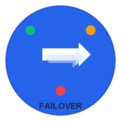

# 🔄 Sistema de Failover para Flutter

<div align="center">




**Um sistema robusto e flexível para gerenciar failover entre diferentes ambientes (produção, desenvolvimento, staging) em aplicações Flutter.**

[](https://pub.dev/packages/failover)
[](https://pub.dev/packages/failover/score)
[](https://pub.dev/packages/failover/score)

</div>

## Características

- ✅ **Gerenciamento de Ambientes**: Suporte para produção, desenvolvimento e staging
- ✅ **Configurações Dinâmicas**: Cada ambiente pode ter configurações específicas
- ✅ **Health Check Automático**: Verificação periódica da saúde dos ambientes
- ✅ **Fallback Automático**: Alternância automática entre ambientes em caso de falha
- ✅ **Listeners**: Sistema de notificação para mudanças de ambiente
- ✅ **HTTP Helper**: Utilitário para requisições HTTP com fallback automático
- ✅ **Socket.IO em Tempo Real**: Comunicação bidirecional com reconexão automática
- ✅ **Operações com Arquivos**: Upload/download com validação e fallback
- ✅ **Múltiplos Tipos de Autenticação**: API Key, Firebase Token, Headers personalizados
- ✅ **Interceptores HTTP**: Sistema extensível para lógica customizada
- ✅ **Singleton Pattern**: Instância única para toda a aplicação
- ✅ **Timeout Configurável**: Timeouts específicos para cada ambiente
- ✅ **Validação de Arquivos**: Controle de tipo, tamanho e regras de negócio

## Instalação

Adicione a dependência ao seu `pubspec.yaml`:

```yaml
dependencies:
  failover: ^1.1.1
```

## Uso Básico

### 1. Inicialização

```dart
import 'package:failover/failover.dart';

void main() async {
  // Inicializa o sistema com ambiente padrão
  await FailoverHelper.initialize(
    initialEnvironment: Environment.development,
  );
  
  runApp(MyApp());
}
```

### 2. Configurações Customizadas

```dart
// Configurações personalizadas para cada ambiente
final customConfigs = {
  Environment.production: EnvironmentConfig(
    apiUrl: 'https://api.meuapp.com',
    apiKey: 'minha_chave_producao',
    firebaseToken: 'firebase_token_producao', // Opcional
    customAuthHeader: 'X-Custom-Auth', // Header personalizado
    enableLogging: false,
    enableAnalytics: true,
    timeout: Duration(seconds: 30),
    maxRetries: 3,
    authType: AuthType.both, // Aceita API Key e Firebase
  ),
  Environment.development: EnvironmentConfig(
    apiUrl: 'https://api-dev.meuapp.com',
    apiKey: 'minha_chave_desenvolvimento',
    firebaseToken: null,
    customAuthHeader: 'X-Dev-Key', // Header personalizado para dev
    enableLogging: true,
    enableAnalytics: false,
    timeout: Duration(seconds: 10),
    maxRetries: 1,
    authType: AuthType.apiKey, // Só API Key
  ),
  Environment.staging: EnvironmentConfig(
    apiUrl: 'https://api-staging.meuapp.com',
    apiKey: 'minha_chave_staging',
    firebaseToken: 'firebase_token_staging',
    customAuthHeader: 'X-Staging-Token', // Header personalizado para staging
    enableLogging: true,
    enableAnalytics: true,
    timeout: Duration(seconds: 20),
    maxRetries: 2,
    authType: AuthType.firebase, // Só Firebase
  ),
};
```

await FailoverHelper.initialize(
  initialEnvironment: Environment.development,
  customConfigs: customConfigs,
);
```

### 3. Requisições HTTP com Fallback

```dart
// Requisição GET simples
try {
  final response = await FailoverHelper.httpRequest(
    endpoint: '/users',
    method: 'GET',
  );
  
  if (response.statusCode == 200) {
    final data = await response.transform(utf8.decoder).join();
    print('Dados recebidos: $data');
  }
} catch (e) {
  print('Erro na requisição: $e');
}

// Requisição POST com dados
try {
  final response = await FailoverHelper.httpRequest(
    endpoint: '/users',
    method: 'POST',
    headers: {'Content-Type': 'application/json'},
    body: jsonEncode({'name': 'João', 'email': 'joao@email.com'}),
  );
} catch (e) {
  print('Erro na requisição: $e');
}
```

### 4. Alternância Manual de Ambiente

```dart
// Alterna para produção
final success = await FailoverHelper.switchTo(Environment.production);
if (success) {
  print('Ambiente alterado para produção');
} else {
  print('Falha ao alterar ambiente');
}

// Obtém o ambiente atual
final currentEnv = FailoverHelper.currentEnvironment;
print('Ambiente atual: $currentEnv');
```

### 5. Listeners para Mudanças de Ambiente

```dart
// Adiciona um listener para mudanças de ambiente
FailoverHelper.onEnvironmentChanged((Environment newEnvironment) {
  print('Ambiente alterado para: $newEnvironment');
  
  // Atualiza a UI ou reconecta serviços
  if (newEnvironment == Environment.production) {
    // Configurações específicas para produção
  } else if (newEnvironment == Environment.development) {
    // Configurações específicas para desenvolvimento
  }
});
```

### 6. Operações Customizadas com Fallback

```dart
final manager = FailoverManager();

final result = await manager.executeWithFallback(
  operation: (config) async {
    // Sua operação customizada aqui
    final client = HttpClient();
    final request = await client.getUrl(
      Uri.parse('${config.apiUrl}/custom-endpoint'),
    );
    request.headers.set('Authorization', 'Bearer ${config.apiKey}');
    
    final response = await request.close();
    client.close();
    return response;
  },
  fallbackOrder: [
    Environment.production,
    Environment.staging,
    Environment.development,
  ],
  timeout: Duration(seconds: 15),
);
```

### 7. Verificação de Saúde dos Ambientes

```dart
// Verifica a saúde de todos os ambientes
final healthStatus = await manager.checkAllEnvironments();
healthStatus.forEach((environment, isHealthy) {
  print('$environment: ${isHealthy ? "Saudável" : "Não saudável"}');
});

// Obtém estatísticas do sistema
final stats = FailoverHelper.getStats();
print('Estatísticas: $stats');
```

### 8. Exemplos de Headers Personalizados

#### **API Corporativa com Header Padrão:**
```dart
EnvironmentConfig(
  apiUrl: 'https://api.empresa.com',
  apiKey: 'chave_corporativa_123',
  authType: AuthType.apiKey,
  // Resultado: x-api-key: chave_corporativa_123
)
```

### 9. Sistema de Interceptores

O sistema suporta **interceptores personalizados** para adicionar lógica customizada antes e depois das requisições:

#### **Interceptor de Logging:**
```dart
class LoggingInterceptor implements HttpInterceptor {
  @override
  Future<void> onRequest(HttpClientRequest request, EnvironmentConfig config) async {
    print('📡 Requisição: ${request.method} ${request.uri}');
    print('🔑 Ambiente: ${config.apiUrl}');
  }
  
  @override
  Future<void> onResponse(HttpClientResponse response, EnvironmentConfig config) async {
    print('✅ Resposta: ${response.statusCode}');
  }
  
  @override
  Future<void> onError(Object error, EnvironmentConfig config) async {
    print('❌ Erro: $error');
  }
}
```

#### **Interceptor de Métricas:**
```dart
class MetricsInterceptor implements HttpInterceptor {
  final Map<String, int> _requestCount = {};
  
  @override
  Future<void> onRequest(HttpClientRequest request, EnvironmentConfig config) async {
    final key = '${config.apiUrl}${request.method}';
    _requestCount[key] = (_requestCount[key] ?? 0) + 1;
  }
  
  @override
  Future<void> onResponse(HttpClientResponse response, EnvironmentConfig config) async {
    // Registra métricas de sucesso
  }
  
  @override
  Future<void> onError(Object error, EnvironmentConfig config) async {
    // Registra métricas de erro
  }
  
  Map<String, int> get metrics => Map.unmodifiable(_requestCount);
}
```

#### **Interceptor de Cache:**
```dart
class CacheInterceptor implements HttpInterceptor {
  final Map<String, dynamic> _cache = {};
  
  @override
  Future<void> onRequest(HttpClientRequest request, EnvironmentConfig config) async {
    if (request.method == 'GET') {
      final cacheKey = '${request.uri}';
      if (_cache.containsKey(cacheKey)) {
        // Retorna do cache se disponível
      }
    }
  }
  
  @override
  Future<void> onResponse(HttpClientResponse response, EnvironmentConfig config) async {
    if (response.statusCode == 200) {
      // Armazena no cache
    }
  }
  
  @override
  Future<void> onError(Object error, EnvironmentConfig config) async {}
}
```

#### **Uso dos Interceptores:**
```dart
final config = EnvironmentConfig(
  apiUrl: 'https://api.meuapp.com',
  apiKey: 'minha_chave',
  interceptors: [
    LoggingInterceptor(),
    MetricsInterceptor(),
    CacheInterceptor(),
  ],
  // ... outras configurações
);
```

#### **API Corporativa com Header Personalizado:**
```dart
EnvironmentConfig(
  apiUrl: 'https://api.empresa.com',
  apiKey: 'chave_corporativa_123',
  customAuthHeader: 'X-API-Key',
  authType: AuthType.apiKey,
  // Resultado: X-API-Key: chave_corporativa_123
)
```

#### **Microserviço com Token Personalizado:**
```dart
EnvironmentConfig(
  apiUrl: 'https://microservice.auth.com',
  firebaseToken: 'firebase_token_456',
  customAuthHeader: 'X-Service-Token',
  authType: AuthType.firebase,
  // Resultado: X-Service-Token: Bearer firebase_token_456
)
```

#### **Sistema Legado com Header Específico:**
```dart
EnvironmentConfig(
  apiUrl: 'https://legacy.api.com',
  apiKey: 'legacy_key_789',
  customAuthHeader: 'X-Legacy-Auth',
  authType: AuthType.apiKey,
  // Resultado: X-Legacy-Auth: legacy_key_789
)
```

#### **Ambiente de Desenvolvimento com Header Simples:**
```dart
EnvironmentConfig(
  apiUrl: 'https://dev.api.com',
  apiKey: 'dev_key_simple',
  customAuthHeader: 'X-Dev-Key',
  authType: AuthType.apiKey,
  // Resultado: X-Dev-Key: dev_key_simple
)
```

#### **Sistema com Autenticação Dupla:**
```dart
EnvironmentConfig(
  apiUrl: 'https://secure.api.com',
  apiKey: 'backup_key',
  firebaseToken: 'primary_token',
  customAuthHeader: 'X-Auth-Header',
  authType: AuthType.both,
  // Resultado: X-Auth-Header: Bearer primary_token
  // Fallback: X-Auth-Header: backup_key
)
```

## Estrutura da API

### EnvironmentConfig

```dart
class EnvironmentConfig {
  final String apiUrl;        // URL base da API
  final String apiKey;        // Chave de autenticação
  final String? firebaseToken; // Token Firebase (opcional)
  final String? customAuthHeader; // Nome personalizado do header (opcional)
  final bool enableLogging;   // Habilita logs
  final bool enableAnalytics; // Habilita analytics
  final Duration timeout;     // Timeout para requisições
  final int maxRetries;       // Número máximo de tentativas
  final AuthType authType;    // Tipo de autenticação
  final List<HttpInterceptor> interceptors; // Lista de interceptores
}
```

### HttpInterceptor

```dart
abstract class HttpInterceptor {
  /// Executado antes da requisição ser enviada
  Future<void> onRequest(HttpClientRequest request, EnvironmentConfig config);
  
  /// Executado após a resposta ser recebida
  Future<void> onResponse(HttpClientResponse response, EnvironmentConfig config);
  
  /// Executado quando ocorre um erro
  Future<void> onError(Object error, EnvironmentConfig config);
}
```

### Tipos de Autenticação

O sistema suporta **3 tipos de autenticação**:

#### **1. API Key (`AuthType.apiKey`)**
```dart
// Usa header: x-api-key: sua_chave_aqui
EnvironmentConfig(
  apiKey: 'sua_api_key',
  authType: AuthType.apiKey,
)
```

#### **2. Firebase Token (`AuthType.firebase`)**
```dart
// Usa header: Authorization: Bearer seu_token_firebase
EnvironmentConfig(
  firebaseToken: 'seu_firebase_token',
  authType: AuthType.firebase,
)
```

#### **3. Ambos (`AuthType.both`)**
```dart
// Tenta Firebase primeiro, depois API Key
EnvironmentConfig(
  apiKey: 'sua_api_key',
  firebaseToken: 'seu_firebase_token',
  authType: AuthType.both,
)
```

### Headers de Autenticação

O sistema automaticamente aplica os headers corretos baseado na configuração:

#### **Headers Padrão:**
- **API Key:** `x-api-key: sua_chave`
- **Firebase:** `Authorization: Bearer seu_token`
- **Ambos:** Prioriza Firebase, fallback para API Key

#### **Headers Personalizados:**
Você pode definir nomes personalizados para os headers de autenticação:

```dart
EnvironmentConfig(
  apiKey: 'sua_chave',
  customAuthHeader: 'X-Custom-Auth', // Em vez de 'x-api-key'
  authType: AuthType.apiKey,
)

EnvironmentConfig(
  firebaseToken: 'seu_token',
  customAuthHeader: 'X-Firebase-Token', // Em vez de 'Authorization'
  authType: AuthType.firebase,
)
```

#### **Exemplos de Headers Personalizados:**
- `X-API-Key: sua_chave`
- `X-Custom-Token: seu_token`
- `X-Auth-Header: sua_chave`
- `X-Service-Key: sua_chave`
- `X-Client-Token: seu_token`

### 10. Socket.IO em Tempo Real

O sistema suporta **conexões Socket.IO** para comunicação em tempo real com fallback automático:

#### **Configuração de Socket.IO:**
```dart
EnvironmentConfig(
  apiUrl: 'https://api.meuapp.com',
  apiKey: 'minha_chave',
  socketUrl: 'wss://socket.meuapp.com',
  enableSocketIO: true,
  socketOptions: {
    'transports': ['websocket'],
    'reconnection': true,
    'reconnectionDelay': 1000,
  },
)
```

#### **Uso Básico:**
```dart
// Conecta automaticamente ao Socket.IO
await FailoverHelper.initialize(
  initialEnvironment: Environment.development,
);

// Emite eventos
await FailoverHelper.emitSocketEvent('user:join', {
  'userId': '123',
  'room': 'chat',
});

// Escuta eventos
FailoverHelper.onSocketEvent('message:new', (data) {
  print('Nova mensagem: $data');
});

// Remove listener
FailoverHelper.offSocketEvent('message:new');
```

#### **Eventos Automáticos:**
- **`connect`**: Conectado ao Socket.IO
- **`disconnect`**: Desconectado do Socket.IO
- **`error`**: Erro na conexão
- **Reconexão automática** em caso de falha

#### **Fallback Automático:**
Quando você alterna de ambiente, o sistema:
1. **Desconecta** do Socket.IO atual
2. **Conecta** ao novo ambiente (se suportar Socket.IO)
3. **Mantém** todos os listeners configurados

### 11. Operações com Arquivos

O sistema suporta **upload e download de arquivos** com fallback automático e validações:

#### **Configurações Avançadas:**

##### **1. Configuração por Ambiente:**
```dart
final configs = {
  Environment.production: EnvironmentConfig(
    apiUrl: 'https://api.production.com',
    apiKey: 'prod_key',
    maxFileSize: 100 * 1024 * 1024, // 100MB
    allowedFileTypes: ['pdf', 'doc', 'docx', 'xls', 'xlsx', 'jpg', 'jpeg', 'png'],
    fileStoragePath: '/storage/production',
  ),
  Environment.development: EnvironmentConfig(
    apiUrl: 'https://api.dev.com',
    apiKey: 'dev_key',
    maxFileSize: 10 * 1024 * 1024, // 10MB
    allowedFileTypes: ['pdf', 'txt', 'jpg', 'png'],
    fileStoragePath: '/storage/development',
  ),
  Environment.staging: EnvironmentConfig(
    apiUrl: 'https://api.staging.com',
    apiKey: 'staging_key',
    maxFileSize: 50 * 1024 * 1024, // 50MB
    allowedFileTypes: ['pdf', 'doc', 'docx', 'jpg', 'png'],
    fileStoragePath: '/storage/staging',
  ),
};
```

##### **2. Validações Customizadas:**
```dart
// Antes do upload, valide regras de negócio
Future<bool> validateFileForUpload(String filePath, String category) async {
  final file = File(filePath);
  final extension = path.extension(filePath).toLowerCase().replaceAll('.', '');
  
  // Validações específicas por categoria
  switch (category) {
    case 'documents':
      return ['pdf', 'doc', 'docx'].contains(extension);
    case 'images':
      return ['jpg', 'jpeg', 'png', 'gif'].contains(extension);
    case 'videos':
      return ['mp4', 'avi', 'mov'].contains(extension);
    default:
      return false;
  }
}
```

#### **Upload Multipart:**
```dart
// Upload básico multipart
final response = await FailoverHelper.multipartUpload(
  endpoint: '/upload',
  fields: {
    'description': 'Meu arquivo',
    'category': 'documentos',
  },
  files: {
    'file': fileBytes, // List<int>
  },
);

// Upload de arquivo com validação automática
final response = await FailoverHelper.uploadFile(
  endpoint: '/upload',
  filePath: '/path/to/document.pdf',
  fieldName: 'document',
  additionalFields: {
    'description': 'Documento importante',
    'priority': 'high',
  },
);
```

#### **Download de Arquivos:**
```dart
// Download como bytes
final bytes = await FailoverHelper.downloadFile(
  endpoint: '/files/document.pdf',
);

// Download para caminho local
final localPath = await FailoverHelper.downloadFileToPath(
  endpoint: '/files/document.pdf',
  localPath: '/downloads/document.pdf',
);
```

#### **Validações Automáticas:**
- **Tamanho máximo** configurável por ambiente
- **Tipos de arquivo** permitidos
- **Existência do arquivo** local
- **Criação automática** de diretórios

#### **Configurações de Arquivo:**
```dart
EnvironmentConfig(
  apiUrl: 'https://api.meuapp.com',
  apiKey: 'minha_chave',
  maxFileSize: 50 * 1024 * 1024, // 50MB
  allowedFileTypes: ['pdf', 'doc', 'docx', 'jpg', 'png'],
  fileStoragePath: '/storage/uploads',
)
```

#### **Casos de Uso Práticos:**

##### **1. Upload de Documentos Corporativos:**
```dart
try {
  final response = await FailoverHelper.uploadFile(
    endpoint: '/documents/upload',
    filePath: '/documents/contrato_empresa.pdf',
    fieldName: 'document',
    additionalFields: {
      'userId': '12345',
      'category': 'contratos',
      'priority': 'high',
      'expiryDate': '2025-12-31',
      'department': 'legal',
    },
  );
  
  print('✅ Documento enviado com sucesso!');
  print('📄 Status: ${response.statusCode}');
} catch (e) {
  print('❌ Erro no upload: $e');
}
```

##### **2. Upload de Imagens de Perfil:**
```dart
try {
  final response = await FailoverHelper.uploadFile(
    endpoint: '/profile/images/upload',
    filePath: '/photos/user_profile.jpg',
    fieldName: 'profileImage',
    additionalFields: {
      'userId': '12345',
      'type': 'profile',
      'description': 'Foto de perfil do usuário',
      'isPublic': 'true',
    },
  );
  
  print('✅ Imagem de perfil enviada!');
} catch (e) {
  print('❌ Erro no upload da imagem: $e');
}
```

##### **3. Download de Relatórios:**
```dart
try {
  final localPath = await FailoverHelper.downloadFileToPath(
    endpoint: '/reports/monthly/2024-12',
    localPath: '/downloads/report_${DateTime.now().millisecondsSinceEpoch}.pdf',
  );
  
  print('✅ Relatório baixado com sucesso!');
  print('📁 Local: $localPath');
} catch (e) {
  print('❌ Erro no download: $e');
}
```

##### **4. Upload em Lote:**
```dart
final files = [
  '/documents/doc1.pdf',
  '/documents/doc2.pdf',
  '/documents/doc3.pdf',
];

for (final filePath in files) {
  try {
    await FailoverHelper.uploadFile(
      endpoint: '/documents/batch-upload',
      filePath: filePath,
      fieldName: 'documents',
      additionalFields: {
        'batchId': 'batch_${DateTime.now().millisecondsSinceEpoch}',
        'totalFiles': files.length.toString(),
      },
    );
    
    print('✅ $filePath enviado com sucesso!');
  } catch (e) {
    print('❌ Erro ao enviar $filePath: $e');
  }
}
```

#### **Tratamento de Erros e Boas Práticas:**

##### **1. Validação de Arquivos:**
```dart
// Sempre valide antes do upload
final file = File(filePath);
if (!await file.exists()) {
  print('❌ Arquivo não encontrado: $filePath');
  return;
}

final fileSize = await file.length();
if (fileSize > 50 * 1024 * 1024) { // 50MB
  print('❌ Arquivo muito grande: ${(fileSize / 1024 / 1024).toStringAsFixed(2)}MB');
  return;
}
```

##### **2. Tratamento de Exceções:**
```dart
try {
  final response = await FailoverHelper.uploadFile(
    endpoint: '/upload',
    filePath: filePath,
    fieldName: 'file',
  );
  
  if (response.statusCode == 200) {
    print('✅ Upload realizado com sucesso!');
  } else {
    print('⚠️ Upload realizado, mas com status: ${response.statusCode}');
  }
} on FileSystemException catch (e) {
  print('❌ Erro de arquivo: $e');
} on ArgumentError catch (e) {
  print('❌ Erro de validação: $e');
} catch (e) {
  print('❌ Erro inesperado: $e');
}
```

##### **3. Monitoramento de Progresso:**
```dart
// Para arquivos grandes, considere implementar progresso
final file = File(filePath);
final totalSize = await file.length();
var uploadedSize = 0;

// Simula progresso (em implementação real, use streams)
print('📤 Iniciando upload...');
print('📊 Tamanho total: ${(totalSize / 1024 / 1024).toStringAsFixed(2)}MB');

// ... upload ...

print('✅ Upload concluído!');
```

### FailoverManager

- `initialize()`: Inicializa o sistema
- `switchEnvironment()`: Alterna para um ambiente específico
- `executeWithFallback()`: Executa operação com fallback automático
- `checkAllEnvironments()`: Verifica saúde de todos os ambientes
- `addListener()`: Adiciona listener para mudanças
- `getStats()`: Obtém estatísticas do sistema
- **`connectSocket()`**: Conecta ao Socket.IO
- **`emitSocketEvent()`**: Emite eventos
- **`onSocketEvent()`**: Escuta eventos
- **`isSocketConnected`**: Status da conexão

### FailoverHelper

- `initialize()`: Inicialização simplificada
- `httpRequest()`: Requisições HTTP com fallback
- `switchTo()`: Alternância de ambiente
- `onEnvironmentChanged()`: Adiciona listener
- `getStats()`: Estatísticas do sistema
- **`connectSocket()`**: Conecta ao Socket.IO
- **`emitSocketEvent()`**: Emite eventos
- **`onSocketEvent()`**: Escuta eventos
- **`isSocketConnected`**: Status da conexão
- **`multipartUpload()`**: Upload multipart com fallback
- **`uploadFile()`**: Upload de arquivo com validação
- **`downloadFile()`**: Download de arquivo como bytes
- **`downloadFileToPath()`**: Download de arquivo para caminho local

## Exemplo Completo

```dart
import 'package:failover/failover.dart';
import 'package:flutter/material.dart';

void main() async {
  WidgetsFlutterBinding.ensureInitialized();
  
  // Inicializa o sistema de failover com headers personalizados
  await FailoverHelper.initialize(
    initialEnvironment: Environment.development,
    customConfigs: {
      Environment.production: EnvironmentConfig(
        apiUrl: 'https://api.meuapp.com',
        apiKey: 'prod_key_123',
        firebaseToken: 'firebase_prod_token',
        customAuthHeader: 'X-Prod-Auth',
        enableLogging: false,
        enableAnalytics: true,
        timeout: Duration(seconds: 30),
        maxRetries: 3,
        authType: AuthType.both,
        socketUrl: 'wss://socket.meuapp.com',
        enableSocketIO: true,
      ),
      Environment.development: EnvironmentConfig(
        apiUrl: 'https://api-dev.meuapp.com',
        apiKey: 'dev_key_456',
        customAuthHeader: 'X-Dev-Key',
        enableLogging: true,
        enableAnalytics: false,
        timeout: Duration(seconds: 10),
        maxRetries: 1,
        authType: AuthType.apiKey,
        socketUrl: 'ws://localhost:3000',
        enableSocketIO: true,
      ),
      Environment.staging: EnvironmentConfig(
        apiUrl: 'https://api-staging.meuapp.com',
        apiKey: 'staging_key_789',
        firebaseToken: 'firebase_staging_token',
        customAuthHeader: 'X-Staging-Token',
        enableLogging: true,
        enableAnalytics: true,
        timeout: Duration(seconds: 20),
        maxRetries: 2,
        authType: AuthType.firebase,
        socketUrl: 'wss://socket-staging.meuapp.com',
        enableSocketIO: true,
      ),
    },
  );
  
  // Adiciona listener para mudanças de ambiente
  FailoverHelper.onEnvironmentChanged((Environment env) {
    print('Ambiente alterado para: $env');
  });
  
  // Configura Socket.IO para chat em tempo real
  FailoverHelper.onSocketEvent('message:new', (data) {
    print('Nova mensagem recebida: $data');
  });
  
  FailoverHelper.onSocketEvent('user:joined', (data) {
    print('Usuário entrou: ${data['username']}');
  });
  
  runApp(MyApp());
}

class MyApp extends StatelessWidget {
  @override
  Widget build(BuildContext context) {
    return MaterialApp(
      title: 'Failover Demo',
      home: FailoverDemoPage(),
    );
  }
}

class FailoverDemoPage extends StatefulWidget {
  @override
  _FailoverDemoPageState createState() => _FailoverDemoPageState();
}

class _FailoverDemoPageState extends State<FailoverDemoPage> {
  String _currentEnvironment = '';
  String _lastResponse = '';

  @override
  void initState() {
    super.initState();
    _updateEnvironmentInfo();
  }

  void _updateEnvironmentInfo() {
    setState(() {
      _currentEnvironment = FailoverHelper.currentEnvironment.name;
    });
  }

  Future<void> _testRequest() async {
    try {
      final response = await FailoverHelper.httpRequest(
        endpoint: '/test',
        method: 'GET',
      );
      
      final data = await response.transform(utf8.decoder).join();
      setState(() {
        _lastResponse = 'Status: ${response.statusCode}\nDados: $data';
      });
    } catch (e) {
      setState(() {
        _lastResponse = 'Erro: $e';
      });
    }
  }

  Future<void> _switchEnvironment(Environment env) async {
    final success = await FailoverHelper.switchTo(env);
    if (success) {
      _updateEnvironmentInfo();
      ScaffoldMessenger.of(context).showSnackBar(
        SnackBar(content: Text('Ambiente alterado para ${env.name}')),
      );
    }
  }

  @override
  Widget build(BuildContext context) {
    return Scaffold(
      appBar: AppBar(title: Text('Sistema de Failover')),
      body: Padding(
        padding: EdgeInsets.all(16.0),
        child: Column(
          crossAxisAlignment: CrossAxisAlignment.stretch,
          children: [
            Card(
              child: Padding(
                padding: EdgeInsets.all(16.0),
                child: Column(
                  children: [
                    Text(
                      'Ambiente Atual: $_currentEnvironment',
                      style: Theme.of(context).textTheme.headline6,
                    ),
                    SizedBox(height: 16),
                    Row(
                      mainAxisAlignment: MainAxisAlignment.spaceEvenly,
                      children: [
                        ElevatedButton(
                          onPressed: () => _switchEnvironment(Environment.development),
                          child: Text('Dev'),
                        ),
                        ElevatedButton(
                          onPressed: () => _switchEnvironment(Environment.staging),
                          child: Text('Staging'),
                        ),
                        ElevatedButton(
                          onPressed: () => _switchEnvironment(Environment.production),
                          child: Text('Prod'),
                        ),
                      ],
                    ),
                  ],
                ),
              ),
            ),
            SizedBox(height: 16),
            ElevatedButton(
              onPressed: _testRequest,
              child: Text('Testar Requisição'),
            ),
            SizedBox(height: 16),
            Card(
              child: Padding(
                padding: EdgeInsets.all(16.0),
                child: Column(
                  crossAxisAlignment: CrossAxisAlignment.start,
                  children: [
                    Text(
                      'Última Resposta:',
                      style: Theme.of(context).textTheme.subtitle1,
                    ),
                    SizedBox(height: 8),
                    Text(_lastResponse.isEmpty ? 'Nenhuma requisição feita' : _lastResponse),
                  ],
                ),
              ),
            ),
          ],
        ),
      ),
    );
  }
}
```

## Roadmap

### 🚀 **Próximas Funcionalidades:**

- 🔄 **Stream de Arquivos**: Upload/download em chunks para arquivos muito grandes
- 📊 **Métricas Avançadas**: Dashboard de performance e uso
- 🔐 **Criptografia**: Criptografia automática de arquivos sensíveis
- 🌐 **CDN Integration**: Suporte para CDNs com fallback
- 📱 **Mobile Optimizations**: Otimizações específicas para dispositivos móveis
- 🔍 **Cache Inteligente**: Sistema de cache com invalidação automática
- 📈 **Analytics Avançados**: Métricas detalhadas de uso e performance

### 🎯 **Funcionalidades em Desenvolvimento:**

- 🔄 **WebSocket Nativo**: Suporte para WebSocket puro além do Socket.IO
- 📁 **Sincronização de Arquivos**: Sincronização bidirecional com servidor
- 🚀 **Compressão Automática**: Compressão inteligente de arquivos

## Contribuição

Contribuições são bem-vindas! Por favor, sinta-se à vontade para:

1. Reportar bugs
2. Sugerir novas funcionalidades
3. Enviar pull requests
4. Melhorar a documentação

## Autor

**Alexandre Lisboa**
- GitHub: [@Alexandrelisboa845](https://github.com/Alexandrelisboa845)
- Repositório: [https://github.com/Alexandrelisboa845/failover](https://github.com/Alexandrelisboa845/failover)

## Licença

Este projeto está licenciado sob a licença MIT - veja o arquivo [LICENSE](LICENSE) para detalhes.
